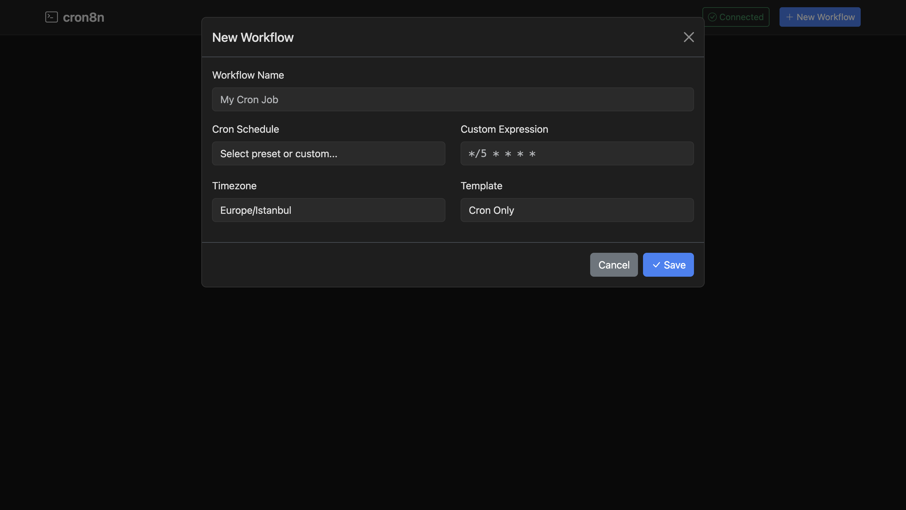
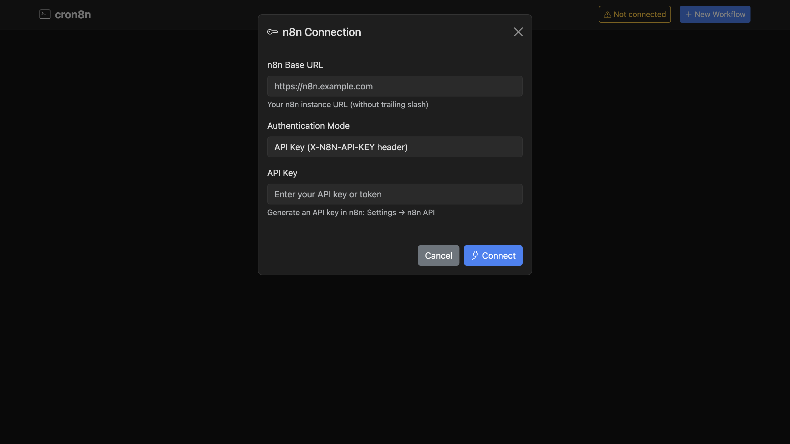

# cron8n

A CLI tool that simplifies creating and managing cron-triggered workflows in n8n.

## Why cron8n?

Managing scheduled workflows in n8n can be challenging:

- **No version control** - Workflows are stored in n8n's database, making it hard to track changes
- **Manual creation** - Each cron workflow requires clicking through the UI
- **No local development** - You can't develop workflows offline and deploy later
- **Scattered workflows** - Hard to see all your cron jobs in one place
- **No templates** - Starting from scratch every time

**cron8n solves these problems:**

- ✅ **Local-first** - Workflows stored as JSON files in your project
- ✅ **Git-friendly** - Version control your scheduled jobs like code
- ✅ **Templates** - Start with pre-built templates (HTTP requests, shell commands, webhooks)
- ✅ **CLI & Web UI** - Choose your preferred interface
- ✅ **Deploy anywhere** - Push to any n8n instance with one command
- ✅ **Central tracking** - See all managed workflows across projects

## Screenshots

### Web UI - Workflow Dashboard


### Web UI - Create Workflow


### Web UI - n8n Connection


## Features

- **Create** new cron workflows from templates
- **Deploy** workflows to your n8n instance
- **Discover** existing cron workflows in n8n
- **Import** unmanaged workflows into cron8n
- **Validate** cron expressions with next run times
- **Track** all managed workflows with labels
- **Web UI** for visual workflow management

## Installation

```bash
# Install globally
npm install -g cron8n

# Or use directly with npx
npx cron8n
```

## Quick Start

### 1. Authenticate with your n8n instance

```bash
# Interactive login
cron8n auth login

# Or with flags
cron8n auth login --baseUrl https://n8n.example.com --mode apiKey --secret YOUR_API_KEY
```

### 2. Create a new cron workflow

```bash
# Interactive mode
cron8n cron new

# Or with flags
cron8n cron new --name "Daily Backup" --cron "0 0 * * *" --timezone "Europe/Istanbul" --template http-request
```

### 3. Deploy to n8n

```bash
cron8n cron deploy daily-backup --activate
```

## Commands

### Web UI

#### `cron8n ui`

Start the web-based UI for visual workflow management.

```bash
# Start UI (opens browser automatically)
cron8n ui

# Custom port
cron8n ui --port 4000

# Don't open browser
cron8n ui --no-browser
```

The web UI provides:
- Dashboard with all workflows
- Create/Edit workflows visually
- Deploy, activate, deactivate workflows
- Connect to n8n instance
- Cron expression validation with live preview

### Authentication

#### `cron8n auth login`

Authenticate with your n8n instance.

```bash
# Interactive
cron8n auth login

# Non-interactive
cron8n auth login --baseUrl https://n8n.example.com --mode apiKey --secret YOUR_KEY
cron8n auth login --baseUrl https://n8n.example.com --mode bearerToken --secret YOUR_TOKEN
```

#### `cron8n auth status`

Check current authentication status and verify connection.

```bash
cron8n auth status
cron8n auth status --json
```

### Cron Workflows

#### `cron8n cron new`

Create a new cron workflow.

```bash
# Interactive mode - prompts for all options
cron8n cron new

# With all options
cron8n cron new \
  --name "My Scheduled Job" \
  --cron "0 */6 * * *" \
  --timezone "Europe/Istanbul" \
  --template http-request
```

**Templates:**
- `cron-only` - Basic cron trigger (starting point, does nothing)
- `shell-command` - Cron trigger + Execute Command (run shell commands on the server)
- `http-request` - Cron trigger + HTTP request
- `webhook-call` - Cron trigger + webhook call

**Cron Presets:**
- `every-minute`: `* * * * *`
- `hourly`: `0 * * * *`
- `daily`: `0 0 * * *`
- `weekly`: `0 0 * * 0`
- `monthly`: `0 0 1 * *`

#### `cron8n cron edit <slug>`

Edit an existing workflow.

```bash
# Interactive edit (select fields to change)
cron8n cron edit my-workflow

# Change specific fields
cron8n cron edit my-workflow --name "New Name"
cron8n cron edit my-workflow --cron "*/5 * * * *"
cron8n cron edit my-workflow --timezone "America/New_York"
cron8n cron edit my-workflow --shell-command "echo hello"
```

#### `cron8n cron deploy <slug>`

Deploy a workflow to n8n.

```bash
# Deploy and activate
cron8n cron deploy my-workflow --activate

# Dry run (show what would happen)
cron8n cron deploy my-workflow --dry-run

# Deploy without activating
cron8n cron deploy my-workflow --no-activate
```

#### `cron8n cron list`

List cron workflows (local by default).

```bash
# List local workflows (default)
cron8n cron list

# Show archived workflows
cron8n cron list --archived

# Show remote workflows from n8n
cron8n cron list --remote

# Show only managed remote workflows
cron8n cron list --managed

# Show only unmanaged remote workflows
cron8n cron list --unmanaged

# JSON output
cron8n cron list --json
```

#### `cron8n cron inspect <slug|workflow-id>`

Inspect a workflow (local or remote).

```bash
# Inspect by local slug (fetches from n8n if deployed)
cron8n cron inspect my-workflow

# Inspect local manifest only
cron8n cron inspect my-workflow --local

# Inspect by remote workflow ID
cron8n cron inspect abc123

# JSON output
cron8n cron inspect my-workflow --json
```

#### `cron8n cron import <workflow-id>`

Import an existing n8n workflow into cron8n management.

```bash
# Import with auto-generated slug
cron8n cron import abc123

# Import with custom slug
cron8n cron import abc123 --slug my-imported-workflow

# Force import (overwrite existing)
cron8n cron import abc123 --force
```

#### `cron8n cron activate <slug|workflow-id>`

Activate a workflow in n8n.

```bash
# Activate by slug
cron8n cron activate my-workflow

# Activate by workflow ID
cron8n cron activate abc123
```

#### `cron8n cron deactivate <slug|workflow-id>`

Deactivate a workflow in n8n.

```bash
# Deactivate by slug
cron8n cron deactivate my-workflow

# Deactivate by workflow ID
cron8n cron deactivate abc123
```

#### `cron8n cron archive <slug>`

Archive a workflow (deactivate remote, move local files to archived folder).

```bash
# Archive a workflow (deactivates in n8n, moves files to archived/)
cron8n cron archive my-workflow

# Archive and delete from n8n completely
cron8n cron archive my-workflow --delete-remote

# Only deactivate remote, keep local files
cron8n cron archive my-workflow --keep-local

# Skip confirmation
cron8n cron archive my-workflow --force
```

#### `cron8n cron validate [expression]`

Validate a cron expression and show next run times.

```bash
# Interactive validation
cron8n cron validate

# Validate specific expression
cron8n cron validate "0 9 * * 1-5"

# With timezone
cron8n cron validate "0 9 * * 1-5" --timezone America/New_York

# Show more runs
cron8n cron validate "0 9 * * *" --count 10

# JSON output
cron8n cron validate "0 * * * *" --json
```

## File Structure

When you create a workflow, cron8n generates:

```
./workflows/
├── my-workflow.json        # n8n workflow definition
└── my-workflow.cron8n.json # cron8n manifest
```

### Manifest Format

```json
{
  "slug": "my-workflow",
  "name": "My Workflow",
  "createdAt": "2026-02-07T10:00:00Z",
  "template": "http-request",
  "cronExpression": "0 * * * *",
  "timezone": "Europe/Istanbul",
  "tags": ["managed-by:cron8n", "cron8n:my-workflow"],
  "lastDeployedWorkflowId": "123",
  "lastDeployedAt": "2026-02-07T12:00:00Z"
}
```

## Label Strategy

cron8n uses tags to track managed workflows:

- `managed-by:cron8n` - Identifies cron8n-managed workflows
- `cron8n:<slug>` - Links workflow to local manifest

This allows cron8n to:
- Differentiate managed vs unmanaged workflows
- Match deployed workflows to local files
- Prevent accidental modifications

## Central Registry

cron8n maintains a central registry at `~/.cron8n/registry.json` to track workflows across all projects:

```json
{
  "workflows": [
    {
      "slug": "daily-backup",
      "projectPath": "/home/user/my-project",
      "manifestPath": "/home/user/my-project/workflows/daily-backup.cron8n.json",
      "workflowId": "123",
      "lastSyncedAt": "2026-02-07T12:00:00Z"
    }
  ]
}
```

## Configuration

Authentication and settings are stored at `~/.cron8n/config.json`.

## Development

```bash
# Install dependencies
npm install

# Build
npm run build

# Development with watch
npm run dev

# Run tests
npm test

# Run tests with coverage
npm run test:coverage

# Type check
npm run typecheck
```

## Requirements

- Node.js >= 18
- n8n instance with API access

## License

MIT
